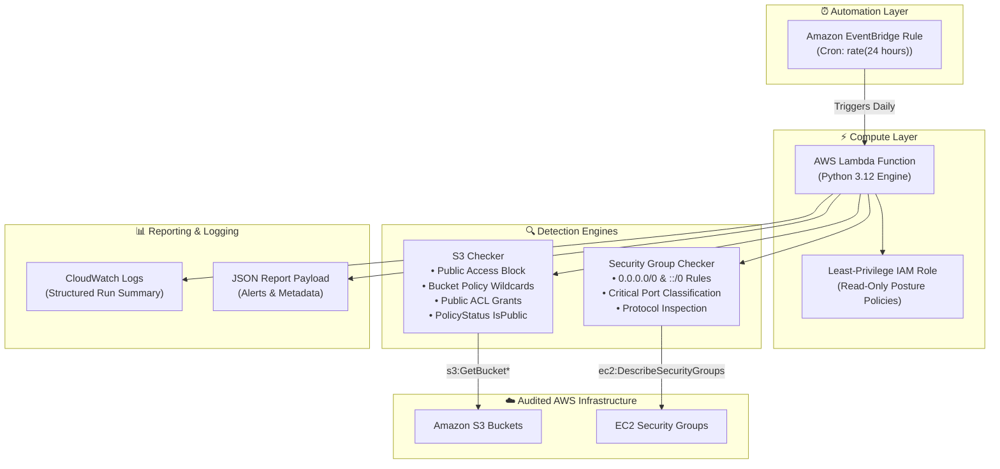

# Serverless Cloud Security Posture Manager (CSPM) for AWS

> **Autonomous, continuous security posture auditing and threat exposure detection for AWS serverless infrastructure.**


---

## 🚨 The Real-World Problem

Cloud misconfigurations remain the **#1 cause of cloud security breaches**. Human error, rapid infrastructure expansion, and legacy configurations often result in:
- **Exposed Data Stores**: S3 buckets configured with public ACLs or wildcard (`"Principal": "*"`) bucket policies containing sensitive PII or financial records.
- **Overly Permissive Ingress Rules**: Security Groups allowing unrestricted (`0.0.0.0/0` or `::/0`) access to administrative services (**SSH port 22**, **RDP port 3389**) or database services (**PostgreSQL port 5432**, **MySQL port 3306**, **MongoDB port 27017**).
- **Audit Lag**: Point-in-time security reviews fail to catch misconfigurations introduced between compliance cycles.

**Serverless CSPM** solves this problem by providing a zero-infrastructure, continuous monitoring engine that automatically scans AWS resources on a recurring EventBridge schedule, identifies attack surface exposures, and generates structured security findings.

---

## 📐 Architecture & Data Flow



---

## 🛡️ Core Security Features

- **Least-Privilege IAM Enforcement**: The Lambda execution role contains strictly read-only permissions (`s3:GetBucket*`, `ec2:DescribeSecurityGroups`, `sts:GetCallerIdentity`) with zero modification rights (`infra/iam_policy.json`).
- **Granular Severity Classification**:
  - 🔴 **CRITICAL**: Wildcard S3 bucket policies, exposed administrative ports (**SSH 22**, **RDP 3389**), and exposed database ports (**5432**, **3306**, **1433**, **27017**).
  - 🟠 **HIGH**: Public S3 ACL grants (`AllUsers`, `AuthenticatedUsers`) and non-critical open-to-world ports (**8080**, **80**, etc.).
  - 🟡 **MEDIUM**: Missing or disabled S3 Public Access Block configurations.
- **Zero-Credential Local Testing**: Built with `moto` to allow full unit and integration testing without needing live AWS credentials or risking cloud bill charges.
- **Infrastructure-as-Code (Terraform)**: Declarative, version-controlled infrastructure deployment supporting automated package zipping (`archive_file`), log group retention, and EventBridge rule binding.

---

## 🚀 Installation & Local Setup

### Prerequisites
- **Python 3.12+**
- **Terraform 1.5+** (for infrastructure deployment)
- Git

### 1. Clone & Set Up Environment

```bash
# Clone the repository
git clone https://github.com/suresh-zatch/ServerLessCloudSecurityPostureManager.git
cd ServerLessCloudSecurityPostureManager

# Create Python virtual environment
python -m venv venv

# Activate virtual environment (Windows PowerShell)
.\venv\Scripts\Activate.ps1
# On Linux/macOS: source venv/bin/activate

# Install dependencies
pip install -r requirements-dev.txt
```

### 2. Run Automated Test Suite & Coverage

```bash
# Run all unit tests with moto mocking and coverage report
python -m pytest tests/ -v --cov=src --cov-report=term-missing
```

### 3. Run the Security Scanner Locally (CLI)

```bash
# Execute local CLI scan (against your AWS CLI profile or mock environment)
python -m src.scanner --region us-east-1 --output-format text
```

### 4. Deploy Infrastructure with Terraform

```bash
cd infra

# Initialize Terraform providers
terraform init

# Review execution plan
terraform plan

# Deploy infrastructure to AWS (requires AWS credentials)
terraform apply
```

---

## 🧪 Proof of Concept & Execution Log

Run the built-in simulation script to test security checks locally in an isolated `moto` environment:

```bash
python demo_trigger.py
```

### Reference Output (`demo_output.txt`)

Below is an authentic execution summary generated by `demo_trigger.py`:

```text
════════════════════════════════════════════════════════════
  SERVERLESS CSPM SCAN REPORT
  Account: 123456789012  |  Region: us-east-1
  Timestamp: 2026-08-12T03:38:01.274590+00:00
════════════════════════════════════════════════════════════

  Summary: {'CRITICAL': 4, 'HIGH': 1, 'MEDIUM': 2, 'LOW': 0, 'INFO': 0}

  [MEDIUM]   S3_PUBLIC_ACCESS_BLOCK    — customer-data-export-public
             → Public Access Block configuration is missing

  [CRITICAL] S3_PUBLIC_POLICY          — customer-data-export-public
             → Bucket policy allows public access with wildcard Principal '*'

  [MEDIUM]   S3_PUBLIC_ACCESS_BLOCK    — public-assets-static-media
             → Public Access Block configuration is missing

  [HIGH]     S3_PUBLIC_ACL             — public-assets-static-media
             → Bucket ACL grants public READ to http://acs.amazonaws.com/groups/global/AllUsers

  [CRITICAL] SG_OPEN_INBOUND           — sg-2eb80eb059611a61d
             → Port 22 (SSH) open to 0.0.0.0/0

  [CRITICAL] SG_OPEN_INBOUND           — sg-1c9e108a4f7f0d294
             → Port 5432 (PostgreSQL) open to 0.0.0.0/0

  [CRITICAL] SG_OPEN_INBOUND           — sg-3f716c7d44ea52de0
             → Port 3389 (RDP) open to ::/0

════════════════════════════════════════════════════════════
```

---

## 📁 Repository Structure

```
ServerLessCloudSecurityPostureManager/
├── demo_trigger.py          # Real-world misconfiguration simulation & test harness
├── demo_output.txt           # Captured proof-of-concept scan report
├── requirements.txt         # Production dependencies (boto3, python-dotenv)
├── requirements-dev.txt     # Test/Dev dependencies (moto, pytest, pytest-cov, black, flake8)
├── tasks.md                 # Project roadmap & phase tracking
├── .gitignore               # Excludes secrets, venvs, build, and terraform artifacts
├── infra/
│   ├── main.tf              # Primary Terraform configuration (Lambda, IAM, EventBridge)
│   ├── variables.tf         # Input parameters & validation rules
│   ├── outputs.tf           # Exported infrastructure attributes
│   └── iam_policy.json      # Least-privilege IAM policy reference
├── src/
│   ├── __init__.py
│   ├── models.py            # Finding & ScanReport dataclasses & severity enums
│   ├── s3_checker.py        # S3 public exposure detection engine
│   ├── sg_checker.py        # EC2 Security Group open ingress detection engine
│   └── scanner.py           # Core orchestrator & AWS Lambda entry point
└── tests/
    ├── __init__.py
    ├── conftest.py          # Shared moto session & client fixtures
    ├── test_s3_checker.py   # Unit tests for S3 checks
    └── test_sg_checker.py   # Unit tests for Security Group checks
```

---

## 📄 License

Distributed under the MIT License. See `LICENSE` for more information.
